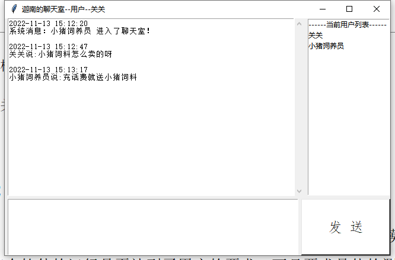
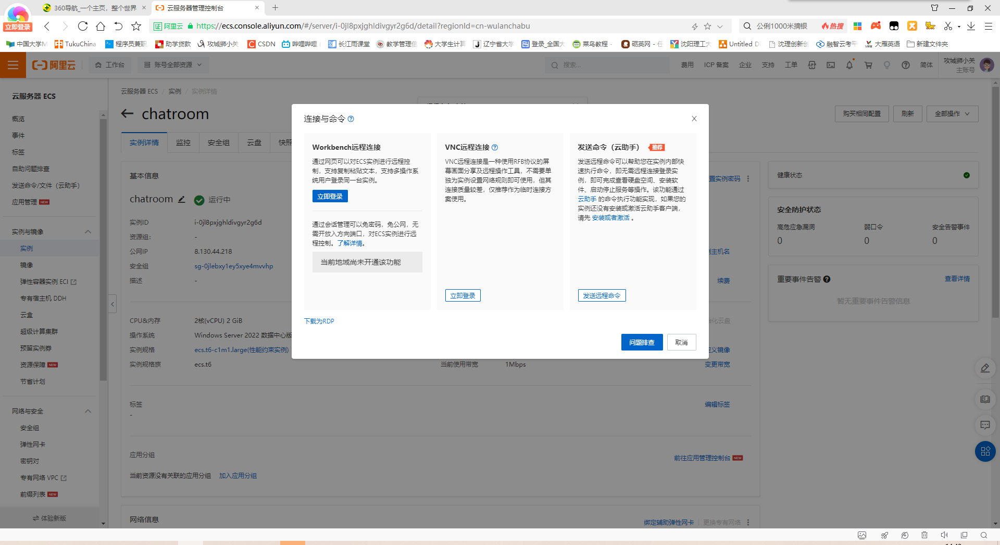
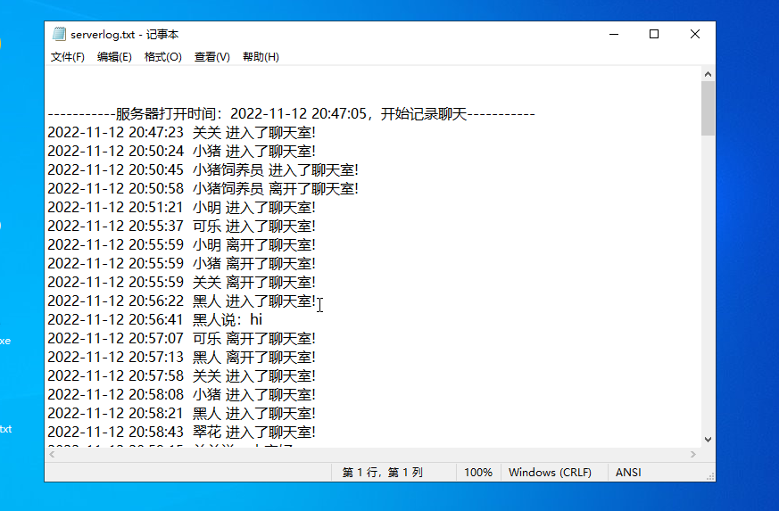

```markdown
# 💬 迦南的聊天室（远程版）


> 👨‍💻 作者：Jia'nan Zhao 
> 📅 开发时间：2022年11月  

```
---

## 🌟 项目简介


迦南的聊天室是一款基于 **Python Socket** 通信协议，采用 **C/S 架构** 开发的轻量级网络聊天室系统。  
它具备群聊广播、用户登录通知、消息记录等核心功能，支持在 **阿里云服务器** 部署实现全国远程通信。

本项目界面简洁，开源免费，零广告、零门槛，致力于让每一位用户都能轻松上手，快速体验互联网实时聊天的乐趣。

---

## 🔧 技术架构

- **开发语言**：Python 3.x  
- **核心技术**：
  - TCP/IP 协议
  - Socket 网络通信
  - 多线程（线程池）
  - 图形界面（Tkinter）
- **部署平台**：阿里云服务器
- **开发工具**：PyCharm

---

## 🧠 核心理念与设计亮点

| 💡 特性 | ✨ 描述 |
|--------|--------|
| 🎨 极简 UI | 无广告、无干扰，极致简洁 |
| 🔓 开源共享 | 代码已计划开源到 GitHub & CSDN |
| 📦 零依赖安装 | 可执行文件仅 8M，双击即用 |
| 🌍 云端部署 | 支持全国跨地远程聊天 |
| 👥 面向大众 | 零编程基础用户也能轻松上手 |

---

## 🛠️ 功能一览

- ✅ 登录注册系统（支持重名处理）
- ✅ 群聊广播消息
- ✅ 实时消息记录至本地 `serverlog.txt`
- ✅ 系统消息提示（上线/离线）
- ✅ 多用户并发聊天（支持线程池处理）
- ✅ 云端远程部署，无需本地搭建环境

---


## 🧪 测试场景

### ✅ 本地一对一聊天测试



- 登录用户 A：「关关」
- 登录用户 B：「小猪饲养员」
- 实现问答式对话，信息双向传递正常。

### ✅ 云端多对多聊天测试



- 多客户端登录阿里云部署的 Server
- 实时广播消息通知
- 系统提示新用户加入聊天室
- 所有对话自动记录到 `serverlog.txt`


---

## 📂 项目结构（简化）

```

├── server/
│   ├── server.py        # 服务器主程序
│   └── serverlog.txt    # 聊天记录日志
├── client/
│   ├── client.py        # 客户端主程序
│   └── gui\_login.py     # 登录页面
└── README.md            # 项目说明文档（当前文件）

```

---

## 📚 学习收获 & 不足反思

>「没有哪一个程序是完美无缺的。」

通过此次开发，我深入理解了 C/S 网络架构、多线程通信与 Python 网络编程原理，初步掌握了系统设计、测试与部署流程。

但由于时间有限和经验不足，部分高级功能如音视频传输、消息加密、安全认证等尚未实现，期待未来的版本升级逐步补齐。

---

## 📥 获取项目源码

- ☁️ 云端体验：需要续费阿里云服务器！（已停）

---

## 🧾 致谢与参考文献

感谢阿里云提供的云端环境测试支持。

> 参考教材与资源包括但不限于：
>
> - 《Python程序设计实用教程》清华大学出版社
> - 《Python开发技术与工程实践》
> - 《腾讯聊天室》技术白皮书
> - Python 官网文档 & Stack Overflow 社区

---


